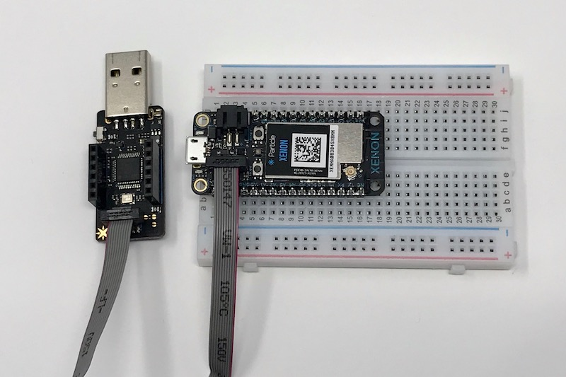
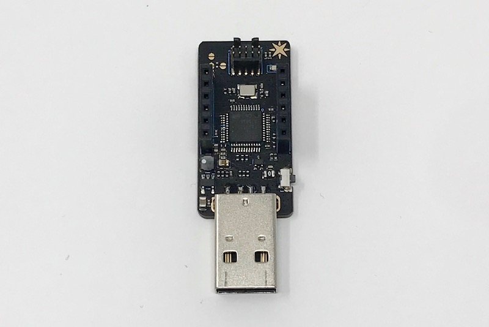

# Particle debugger

**Design files for the CMSIS-DAP debugger**

The Particle Debugger gives you the power of professional debugging at a fraction of the cost. Using this accessory, you’ll be able to program Particle mesh-ready hardware over common interfaces like JTAG and SWD, using open source tools like GDB and openocd.

Supports the open source [CMSIS-DAP specification](https://os.mbed.com/handbook/DAPLink) and DAPLink firmware developed by ARM. On Mac, Linux, and Windows it requires no additional device drivers. 

It also provides a USB to TTL serial port. This requires no device drivers on Mac, Linux, or Windows 10 or later, but you may need to [install a device driver](https://os.mbed.com/docs/v5.9/tutorials/windows-serial-driver.html) for earlier versions of Windows to use the serial port feature.

Comes with one JTAG ribbon cable.

For more information about debugging see the [JTAG FAQ](https://docs.particle.io/support/particle-tools-faq/jtag/). Future version of Particle Workbench will support the Particle Debugger as well.

### Debugging mesh devices

Connecting a Argon, Boron, or Xenon to the debugger is as easy as connecting the included ribbon cable, as pictured below. It's keyed so it will only go in one way. The devices ship with a small plastic protective plug in the debugging connector; make sure you remove that first.

### Debugging legacy platforms

Using the headers on the Particle Debugger you can attach it to other ARM processor devices like the STM32 in the Particle Photon, P1, Electron, and E Series for SWD (serial wire debug).

With the debugger positioned like this, USB connector toward you and the headers facing up:

| Left Header | Right Header |
| --- | ----- |
| VDD | SWCLK |
| RTS | SWDIO |
| RX  | NC    |
| TX  | NC    |  
| CTS | GND   | 
| GND | VUSB  |

In order to use SWD debugging you need to connect:

- D7: SWDIO
- D6: SWCLK
- GND

## Connector

If you want to include the 5x2 micro JTAG connector on your own board a connector compatible with this one works:
 
- Connector Header Surface Mount 10 position 5x2 0.050" (1.27mm)
- [Samtec FTSH-105-01-F-DV-K](https://www.digikey.com/product-detail/en/FTSH-105-01-F-DV-K/SAM8796-ND/2649974)

In the connector directory is:

- JTAGConn.lbr, an Eagle CAD library file containing this connector footprint, symbol, and device. The device has all of the pins labeled for easy use.
- JTAGTest1.brd and .sch. This is just a simple breakout and is what I used to test the footprint. It works.

## Firmware Update

To update the interface firmware with the latest version:

1. Download the latest interface firmware from the firmware directory, above.
2. Press and hold the button on the Debugger.
3. Plug into an USB port of your PC.
4. It will show up a `MAINTENANCE` drive/volume.
5. Drag and drop the firmware to the drive/volume.
6. After that, it will be unmounted and remounted automatically and showing a `DAPLink` drive/volume.
7. Now, you can drag and drop any nRF52840 firmware into the `DAPLink` drive/volume to test.

